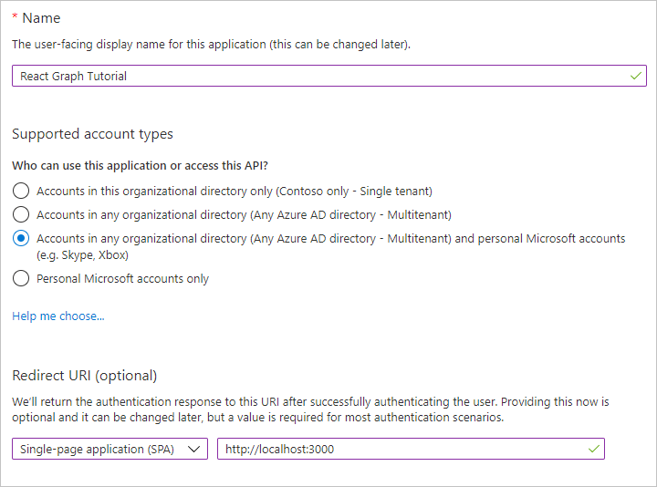

<!-- markdownlint-disable MD002 MD041 -->

Dans cet exercice, vous allez créer une inscription de l’application Web Azure AD à l’aide du centre d’administration Azure Active Directory.In this exercise, you will create a new Azure AD web application registration using the Azure Active Directory admin center.

1. Ouvrez un navigateur et accédez au [Centre d’administration Azure Active Directory](https://aad.portal.azure.com).Open a browser and navigate to the [Azure Active Directory admin center](https://aad.portal.azure.com). Connectez-vous à l’aide d’un **compte personnel** (compte Microsoft) ou d’un **compte professionnel ou scolaire**.Login using a **personal account** (aka: Microsoft Account) or **Work or School Account**.

1. Sélectionnez **Azure Active Directory** dans le volet de navigation gauche, puis sélectionnez **Inscriptions d’applications** sous **Gérer**.Select **Azure Active Directory** in the left-hand navigation, then select **App registrations** under **Manage**.

    

    > [!NOTE]
    > Les utilisateurs Azure AD B2C peuvent uniquement voir les **inscriptions des applications (héritées)**.Azure AD B2C users may only see **App registrations (legacy)**. Dans ce cas, accédez directement à [https://aka.ms/appregistrations](https://aka.ms/appregistrations).In this case, please go directly to [https://aka.ms/appregistrations](https://aka.ms/appregistrations).

1. Sélectionnez **Nouvelle inscription**.Select **New registration**. Sur la page **Inscrire une application**, définissez les valeurs comme suit.On the **Register an application** page, set the values as follows.

    - Définissez le **Nom** sur `React Graph Tutorial`.Set **Name** to `React Graph Tutorial`.
    - Définissez les **Types de comptes pris en charge** sur **Comptes dans un annuaire organisationnel et comptes personnels Microsoft**.Set **Supported account types** to **Accounts in any organizational directory and personal Microsoft accounts**.
    - Sous **URI de redirection**, définissez la première flèche déroulante sur `Web`, et la valeur sur `http://localhost:3000`.Under **Redirect URI**, set the first drop-down to `Web` and set the value to `http://localhost:3000`.

    

1. Choisissez **Inscrire**.Choose **Register**. Sur la page **didacticiel du graphique REACT** , copiez la valeur de l' **ID d’application (client)** et enregistrez-la, vous en aurez besoin à l’étape suivante.On the **React Graph Tutorial** page, copy the value of the **Application (client) ID** and save it, you will need it in the next step.

    

1. Sous **Gérer**, sélectionnez **Authentification**.Select **Authentication** under **Manage**. Recherchez la section **Grant implicite** et activez les **jetons d’accès** et les **jetons ID**.Locate the **Implicit grant** section and enable **Access tokens** and **ID tokens**. Cliquez sur **Enregistrer**.Choose **Save**.

    
