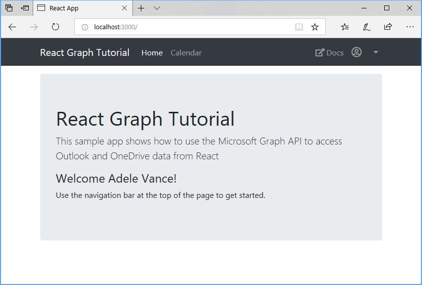
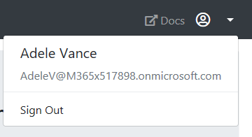

<!-- markdownlint-disable MD002 MD041 -->

<span data-ttu-id="2751f-101">Dans cet exercice, vous allez étendre l’application de l’exercice précédent pour prendre en charge l’authentification avec Azure AD.</span><span class="sxs-lookup"><span data-stu-id="2751f-101">In this exercise you will extend the application from the previous exercise to support authentication with Azure AD.</span></span> <span data-ttu-id="2751f-102">Cela est nécessaire pour obtenir le jeton d’accès OAuth nécessaire pour appeler Microsoft Graph.</span><span class="sxs-lookup"><span data-stu-id="2751f-102">This is required to obtain the necessary OAuth access token to call the Microsoft Graph.</span></span> <span data-ttu-id="2751f-103">Dans cette étape, vous allez intégrer la bibliothèque de la [bibliothèque d’authentification Microsoft](https://github.com/AzureAD/microsoft-authentication-library-for-js) dans l’application.</span><span class="sxs-lookup"><span data-stu-id="2751f-103">In this step you will integrate the [Microsoft Authentication Library](https://github.com/AzureAD/microsoft-authentication-library-for-js) library into the application.</span></span>

<span data-ttu-id="2751f-104">Créez un fichier dans le `./src` répertoire nommé `Config.js` et ajoutez le code suivant.</span><span class="sxs-lookup"><span data-stu-id="2751f-104">Create a new file in the `./src` directory named `Config.js` and add the following code.</span></span>

```js
module.exports = {
  appId: 'YOUR_APP_ID_HERE',
  scopes: [
    "user.read",
    "calendars.read"
  ]
};
```

<span data-ttu-id="2751f-105">Remplacez `YOUR_APP_ID_HERE` par l’ID de l’application dans le portail d’inscription des applications.</span><span class="sxs-lookup"><span data-stu-id="2751f-105">Replace `YOUR_APP_ID_HERE` with the application ID from the Application Registration Portal.</span></span>

> [!IMPORTANT]
> <span data-ttu-id="2751f-106">Si vous utilisez le contrôle de code source tel que git, il est maintenant recommandé d’exclure le `Config.js` fichier du contrôle de code source afin d’éviter une fuite accidentelle de votre ID d’application.</span><span class="sxs-lookup"><span data-stu-id="2751f-106">If you're using source control such as git, now would be a good time to exclude the `Config.js` file from source control to avoid inadvertently leaking your app ID.</span></span>

<span data-ttu-id="2751f-107">Ouvrez `./src/App.js` et ajoutez les instructions `import` suivantes en haut du fichier.</span><span class="sxs-lookup"><span data-stu-id="2751f-107">Open `./src/App.js` and add the following `import` statements to the top of the file.</span></span>

```js
import config from './Config';
import { UserAgentApplication } from 'msal';
```

## <a name="implement-sign-in"></a><span data-ttu-id="2751f-108">Mettre en œuvre la connexion</span><span class="sxs-lookup"><span data-stu-id="2751f-108">Implement sign-in</span></span>

<span data-ttu-id="2751f-109">Commencez par mettre à jour `constructor` le pour `App` la classe afin de créer une instance `UserAgentApplication` de la classe `getUser` et d’appeler pour voir s’il existe déjà un utilisateur connecté.</span><span class="sxs-lookup"><span data-stu-id="2751f-109">Start by updating the `constructor` for the `App` class to create an instance of the `UserAgentApplication` class and call `getUser` to see if there's already a logged-in user.</span></span> <span data-ttu-id="2751f-110">Remplacez le existant `constructor` par ce qui suit.</span><span class="sxs-lookup"><span data-stu-id="2751f-110">Replace the existing `constructor` with the following.</span></span>

```js
constructor(props) {
  super(props);

  this.userAgentApplication = new UserAgentApplication({
        auth: {
            clientId: config.appId
        },
        cache: {
            cacheLocation: "localStorage",
            storeAuthStateInCookie: true
        }
    });

  var user = this.userAgentApplication.getAccount();

  this.state = {
    isAuthenticated: (user !== null),
    user: {},
    error: null
  };

  if (user) {
    // Enhance user object with data from Graph
    this.getUserProfile();
  }
}
```

<span data-ttu-id="2751f-111">Ce code initialise la `UserAgentApplication` classe avec votre ID d’application et vérifie la présence d’un utilisateur.</span><span class="sxs-lookup"><span data-stu-id="2751f-111">This code initializes the `UserAgentApplication` class with your application ID and checks for the presence of a user.</span></span> <span data-ttu-id="2751f-112">S’il existe un utilisateur, il `isAuthenticated` prend la valeur true.</span><span class="sxs-lookup"><span data-stu-id="2751f-112">If there is a user, it sets `isAuthenticated` to true.</span></span> <span data-ttu-id="2751f-113">La `getUserProfile` méthode n’est pas encore implémentée.</span><span class="sxs-lookup"><span data-stu-id="2751f-113">The `getUserProfile` method isn't implemented yet.</span></span> <span data-ttu-id="2751f-114">Vous allez implémenter un peu plus tard.</span><span class="sxs-lookup"><span data-stu-id="2751f-114">You will implement this a bit later.</span></span>

<span data-ttu-id="2751f-115">Ensuite, ajoutez une fonction à la `App` classe pour effectuer la connexion.</span><span class="sxs-lookup"><span data-stu-id="2751f-115">Next, add a function to the `App` class to do the login.</span></span> <span data-ttu-id="2751f-116">Ajoutez la fonction suivante à la classe `App`.</span><span class="sxs-lookup"><span data-stu-id="2751f-116">Add the following function to the `App` class.</span></span>

```js
async login() {
  try {
    await this.userAgentApplication.loginPopup(
        {
          scopes: config.scopes,
          prompt: "select_account"
      });
    await this.getUserProfile();
  }
  catch(err) {
    var error = {};

    if (typeof(err) === 'string') {
      var errParts = err.split('|');
      error = errParts.length > 1 ?
        { message: errParts[1], debug: errParts[0] } :
        { message: err };
    } else {
      error = {
        message: err.message,
        debug: JSON.stringify(err)
      };
    }

    this.setState({
      isAuthenticated: false,
      user: {},
      error: error
    });
  }
}
```

<span data-ttu-id="2751f-117">Cette méthode appelle la `loginPopup` fonction pour effectuer la connexion, puis appelle la `getUserProfile` fonction.</span><span class="sxs-lookup"><span data-stu-id="2751f-117">This method calls the `loginPopup` function to do the login, then calls the `getUserProfile` function.</span></span>

<span data-ttu-id="2751f-118">À présent, ajoutez une fonction pour déconnecter.</span><span class="sxs-lookup"><span data-stu-id="2751f-118">Now add a function to logout.</span></span> <span data-ttu-id="2751f-119">Ajoutez la fonction suivante à la classe `App`.</span><span class="sxs-lookup"><span data-stu-id="2751f-119">Add the following function to the `App` class.</span></span>

```js
logout() {
  this.userAgentApplication.logout();
}
```

<span data-ttu-id="2751f-120">À présent que `login` les `logout` méthodes et sont implémentées, `NavBar` mettez `Welcome` à jour les `render` éléments et dans `App` la méthode de la classe.</span><span class="sxs-lookup"><span data-stu-id="2751f-120">Now that the `login` and `logout` methods are implemented, update the `NavBar` and `Welcome` elements in the `render` method of the `App` class.</span></span> <span data-ttu-id="2751f-121">Remplacez l’élément `NavBar` existant par ce qui suit.</span><span class="sxs-lookup"><span data-stu-id="2751f-121">Replace the existing `NavBar` element with the following.</span></span>

```JSX
<NavBar
  isAuthenticated={this.state.isAuthenticated}
  authButtonMethod={this.state.isAuthenticated ? this.logout.bind(this) : this.login.bind(this)}
  user={this.state.user}/>
```

<span data-ttu-id="2751f-122">Remplacez l’élément `Welcome` existant par ce qui suit.</span><span class="sxs-lookup"><span data-stu-id="2751f-122">Replace the existing `Welcome` element with the following.</span></span>

```JSX
<Welcome {...props}
  isAuthenticated={this.state.isAuthenticated}
  user={this.state.user}
  authButtonMethod={this.login.bind(this)} />
```

<span data-ttu-id="2751f-123">Enfin, implémentez `getUserProfile` la fonction.</span><span class="sxs-lookup"><span data-stu-id="2751f-123">Finally, implement the `getUserProfile` function.</span></span> <span data-ttu-id="2751f-124">Ajoutez la fonction suivante à la classe `App`.</span><span class="sxs-lookup"><span data-stu-id="2751f-124">Add the following function to the `App` class.</span></span>

```js
async getUserProfile() {
  try {
    // Get the access token silently
    // If the cache contains a non-expired token, this function
    // will just return the cached token. Otherwise, it will
    // make a request to the Azure OAuth endpoint to get a token

    var accessToken = await this.userAgentApplication.acquireTokenSilent({
        scopes: config.scopes
      });

    if (accessToken) {
      // TEMPORARY: Display the token in the error flash
      this.setState({
        isAuthenticated: true,
        error: { message: "Access token:", debug: accessToken.accessToken }
      });
    }
  }
  catch(err) {
    var errParts = err.split('|');
    this.setState({
      isAuthenticated: false,
      user: {},
      error: { message: errParts[1], debug: errParts[0] }
    });
  }
}
```

<span data-ttu-id="2751f-125">Ce code appelle `acquireTokenSilent` pour obtenir un jeton d’accès, puis renvoie simplement le jeton en tant qu’erreur.</span><span class="sxs-lookup"><span data-stu-id="2751f-125">This code calls `acquireTokenSilent` to get an access token, then just outputs the token as an error.</span></span>

<span data-ttu-id="2751f-126">Enregistrez vos modifications et actualisez le navigateur.</span><span class="sxs-lookup"><span data-stu-id="2751f-126">Save your changes and refresh the browser.</span></span> <span data-ttu-id="2751f-127">Cliquez sur le bouton de connexion et vous devez être redirigé vers `https://login.microsoftonline.com`.</span><span class="sxs-lookup"><span data-stu-id="2751f-127">Click the sign-in button and you should be redirected to `https://login.microsoftonline.com`.</span></span> <span data-ttu-id="2751f-128">Connectez-vous avec votre compte Microsoft et acceptez les autorisations demandées.</span><span class="sxs-lookup"><span data-stu-id="2751f-128">Login with your Microsoft account and consent to the requested permissions.</span></span> <span data-ttu-id="2751f-129">La page de l’application doit être actualisée, affichant le jeton.</span><span class="sxs-lookup"><span data-stu-id="2751f-129">The app page should refresh, showing the token.</span></span>

### <a name="get-user-details"></a><span data-ttu-id="2751f-130">Obtenir les détails de l’utilisateur</span><span class="sxs-lookup"><span data-stu-id="2751f-130">Get user details</span></span>

<span data-ttu-id="2751f-131">Commencez par créer un fichier qui contiendra tous vos appels Microsoft Graph.</span><span class="sxs-lookup"><span data-stu-id="2751f-131">Start by creating a new file to hold all of your Microsoft Graph calls.</span></span> <span data-ttu-id="2751f-132">Créez un fichier dans le `./src` répertoire appelé `GraphService.js` et ajoutez le code suivant.</span><span class="sxs-lookup"><span data-stu-id="2751f-132">Create a new file in the `./src` directory called `GraphService.js` and add the following code.</span></span>

```js
var graph = require('@microsoft/microsoft-graph-client');

function getAuthenticatedClient(accessToken) {
  // Initialize Graph client
  const client = graph.Client.init({
    // Use the provided access token to authenticate
    // requests
    authProvider: (done) => {
      done(null, accessToken.accessToken);
    }
  });

  return client;
}

export async function getUserDetails(accessToken) {
  const client = getAuthenticatedClient(accessToken);

  const user = await client.api('/me').get();
  return user;
}
```

<span data-ttu-id="2751f-133">Cette fonctionnalité implémente `getUserDetails` la fonction, qui utilise le kit de développement logiciel ( `/me` SDK) Microsoft Graph pour appeler le point de terminaison et renvoyer le résultat.</span><span class="sxs-lookup"><span data-stu-id="2751f-133">This implements the `getUserDetails` function, which uses the Microsoft Graph SDK to call the `/me` endpoint and return the result.</span></span>

<span data-ttu-id="2751f-134">Mettez à `getUserProfile` jour la `./src/App.js` méthode dans pour appeler cette fonction.</span><span class="sxs-lookup"><span data-stu-id="2751f-134">Update the `getUserProfile` method in `./src/App.js` to call this function.</span></span> <span data-ttu-id="2751f-135">Tout d’abord, ajoutez `import` l’instruction suivante en haut du fichier.</span><span class="sxs-lookup"><span data-stu-id="2751f-135">First, add the following `import` statement to the top of the file.</span></span>

```js
import { getUserDetails } from './GraphService';
```

<span data-ttu-id="2751f-136">Remplacez la fonction `getUserProfile` existante par le code suivant.</span><span class="sxs-lookup"><span data-stu-id="2751f-136">Replace the existing `getUserProfile` function with the following code.</span></span>

```js
async getUserProfile() {
  try {
    // Get the access token silently
    // If the cache contains a non-expired token, this function
    // will just return the cached token. Otherwise, it will
    // make a request to the Azure OAuth endpoint to get a token

    var accessToken = await this.userAgentApplication.acquireTokenSilent({
      scopes: config.scopes
    });

    if (accessToken) {
      // Get the user's profile from Graph
      var user = await getUserDetails(accessToken);
      this.setState({
        isAuthenticated: true,
        user: {
          displayName: user.displayName,
          email: user.mail || user.userPrincipalName
        },
        error: null
      });
    }
  }
  catch(err) {
    var error = {};
    if (typeof(err) === 'string') {
      var errParts = err.split('|');
      error = errParts.length > 1 ?
        { message: errParts[1], debug: errParts[0] } :
        { message: err };
    } else {
      error = {
        message: err.message,
        debug: JSON.stringify(err)
      };
    }

    this.setState({
      isAuthenticated: false,
      user: {},
      error: error
    });
  }
}
```

<span data-ttu-id="2751f-137">Maintenant, si vous enregistrez vos modifications et démarrez l’application, après vous être connecté, vous devez revenir sur la page d’accueil, mais l’interface utilisateur doit changer pour indiquer que vous êtes connecté.</span><span class="sxs-lookup"><span data-stu-id="2751f-137">Now if you save your changes and start the app, after sign-in you should end up back on the home page, but the UI should change to indicate that you are signed-in.</span></span>



<span data-ttu-id="2751f-139">Cliquez sur Avatar de l’utilisateur dans le coin supérieur droit pour accéder au lien **déconnexion** .</span><span class="sxs-lookup"><span data-stu-id="2751f-139">Click the user avatar in the top right corner to access the **Sign Out** link.</span></span> <span data-ttu-id="2751f-140">Cliquez sur **déconnexion** pour réinitialiser la session et revenir à la page d’accueil.</span><span class="sxs-lookup"><span data-stu-id="2751f-140">Clicking **Sign Out** resets the session and returns you to the home page.</span></span>



## <a name="storing-and-refreshing-tokens"></a><span data-ttu-id="2751f-142">Stockage et actualisation des jetons</span><span class="sxs-lookup"><span data-stu-id="2751f-142">Storing and refreshing tokens</span></span>

<span data-ttu-id="2751f-143">À ce stade, votre application a un jeton d’accès, qui est envoyé `Authorization` dans l’en-tête des appels d’API.</span><span class="sxs-lookup"><span data-stu-id="2751f-143">At this point your application has an access token, which is sent in the `Authorization` header of API calls.</span></span> <span data-ttu-id="2751f-144">Il s’agit du jeton qui permet à l’application d’accéder à Microsoft Graph pour le compte de l’utilisateur.</span><span class="sxs-lookup"><span data-stu-id="2751f-144">This is the token that allows the app to access the Microsoft Graph on the user's behalf.</span></span>

<span data-ttu-id="2751f-145">Toutefois, ce jeton est éphémère.</span><span class="sxs-lookup"><span data-stu-id="2751f-145">However, this token is short-lived.</span></span> <span data-ttu-id="2751f-146">Le jeton expire une heure après son émission.</span><span class="sxs-lookup"><span data-stu-id="2751f-146">The token expires an hour after it is issued.</span></span> <span data-ttu-id="2751f-147">C’est ici que le jeton d’actualisation devient utile.</span><span class="sxs-lookup"><span data-stu-id="2751f-147">This is where the refresh token becomes useful.</span></span> <span data-ttu-id="2751f-148">Le jeton d’actualisation permet à l’application de demander un nouveau jeton d’accès sans demander à l’utilisateur de se reconnecter.</span><span class="sxs-lookup"><span data-stu-id="2751f-148">The refresh token allows the app to request a new access token without requiring the user to sign in again.</span></span>

<span data-ttu-id="2751f-149">Étant donné que l’application utilise la bibliothèque MSAL, vous n’avez pas besoin d’implémenter de logique d’actualisation ou de stockage de jetons.</span><span class="sxs-lookup"><span data-stu-id="2751f-149">Because the app is using the MSAL library, you do not have to implement any token storage or refresh logic.</span></span> <span data-ttu-id="2751f-150">La `UserAgentApplication` méthode met en cache le jeton dans la session de navigateur.</span><span class="sxs-lookup"><span data-stu-id="2751f-150">The `UserAgentApplication` method caches the token in the browser session.</span></span> <span data-ttu-id="2751f-151">La `acquireTokenSilent` méthode vérifie d’abord le jeton mis en cache et, s’il n’a pas expiré, il le renvoie.</span><span class="sxs-lookup"><span data-stu-id="2751f-151">The `acquireTokenSilent` method first checks the cached token, and if it is not expired, it returns it.</span></span> <span data-ttu-id="2751f-152">Si elle a expiré, elle utilise le jeton d’actualisation mis en cache pour en obtenir une nouvelle.</span><span class="sxs-lookup"><span data-stu-id="2751f-152">If it is expired, it uses the cached refresh token to obtain a new one.</span></span> <span data-ttu-id="2751f-153">Vous utiliserez cette méthode plus dans le module suivant.</span><span class="sxs-lookup"><span data-stu-id="2751f-153">You'll use this method more in the following module.</span></span>
