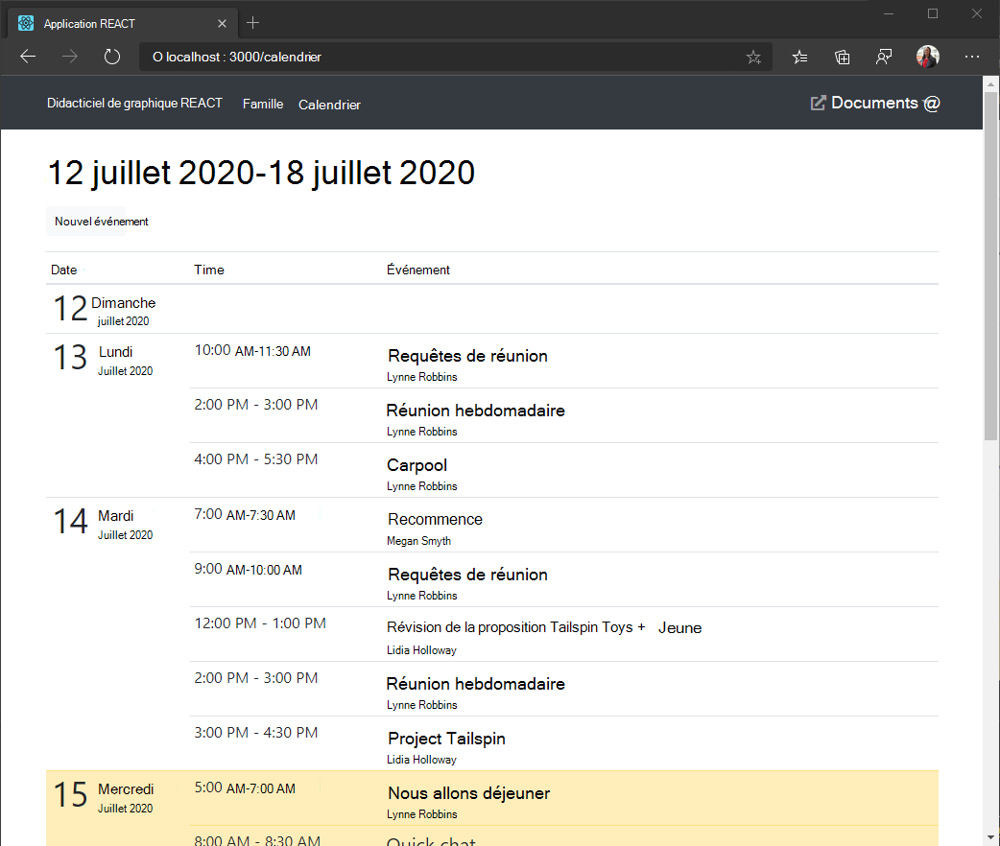

<!-- markdownlint-disable MD002 MD041 -->

<span data-ttu-id="ee05b-101">Dans cet exercice, vous allez incorporer Microsoft Graph dans l’application.</span><span class="sxs-lookup"><span data-stu-id="ee05b-101">In this exercise you will incorporate the Microsoft Graph into the application.</span></span> <span data-ttu-id="ee05b-102">Pour cette application, vous allez utiliser la bibliothèque [Microsoft-Graph-client](https://github.com/microsoftgraph/msgraph-sdk-javascript) pour passer des appels à Microsoft Graph.</span><span class="sxs-lookup"><span data-stu-id="ee05b-102">For this application, you will use the [microsoft-graph-client](https://github.com/microsoftgraph/msgraph-sdk-javascript) library to make calls to Microsoft Graph.</span></span>

## <a name="get-calendar-events-from-outlook"></a><span data-ttu-id="ee05b-103">Récupérer les événements de calendrier à partir d’Outlook</span><span class="sxs-lookup"><span data-stu-id="ee05b-103">Get calendar events from Outlook</span></span>

1. <span data-ttu-id="ee05b-104">Ouvrez `./src/GraphService.ts` et ajoutez la fonction suivante.</span><span class="sxs-lookup"><span data-stu-id="ee05b-104">Open `./src/GraphService.ts` and add the following function.</span></span>

    :::code language="typescript" source="../demo/graph-tutorial/src/GraphService.ts" id="getEventsSnippet":::

    <span data-ttu-id="ee05b-105">Que fait ce code ?</span><span class="sxs-lookup"><span data-stu-id="ee05b-105">Consider what this code is doing.</span></span>

    - <span data-ttu-id="ee05b-106">L’URL qui sera appelée est `/me/events`.</span><span class="sxs-lookup"><span data-stu-id="ee05b-106">The URL that will be called is `/me/events`.</span></span>
    - <span data-ttu-id="ee05b-107">La `select` méthode limite les champs renvoyés pour chaque événement à ceux que l’affichage utilise réellement.</span><span class="sxs-lookup"><span data-stu-id="ee05b-107">The `select` method limits the fields returned for each events to just those the view will actually use.</span></span>
    - <span data-ttu-id="ee05b-108">La `orderby` méthode trie les résultats en fonction de la date et de l’heure de leur création, avec l’élément le plus récent en premier.</span><span class="sxs-lookup"><span data-stu-id="ee05b-108">The `orderby` method sorts the results by the date and time they were created, with the most recent item being first.</span></span>

1. <span data-ttu-id="ee05b-109">Créez un composant REACT pour afficher les résultats de l’appel.</span><span class="sxs-lookup"><span data-stu-id="ee05b-109">Create a React component to display the results of the call.</span></span> <span data-ttu-id="ee05b-110">Créez un fichier dans le `./src` répertoire nommé `Calendar.tsx` et ajoutez le code suivant.</span><span class="sxs-lookup"><span data-stu-id="ee05b-110">Create a new file in the `./src` directory named `Calendar.tsx` and add the following code.</span></span>

    ```typescript
    import React from 'react';
    import { Table } from 'reactstrap';
    import moment from 'moment';
    import { Event } from 'microsoft-graph';
    import { config } from './Config';
    import { getEvents } from './GraphService';
    import withAuthProvider, { AuthComponentProps } from './AuthProvider';

    interface CalendarState {
      events: Event[];
    }

    // Helper function to format Graph date/time
    function formatDateTime(dateTime: string | undefined) {
      if (dateTime !== undefined) {
        return moment.utc(dateTime).local().format('M/D/YY h:mm A');
      }
    }

    class Calendar extends React.Component<AuthComponentProps, CalendarState> {
      constructor(props: any) {
        super(props);

        this.state = {
          events: []
        };
      }

      async componentDidMount() {
        try {
          // Get the user's access token
          var accessToken = await this.props.getAccessToken(config.scopes);
          // Get the user's events
          var events = await getEvents(accessToken);
          // Update the array of events in state
          this.setState({events: events.value});
        }
        catch(err) {
          this.props.setError('ERROR', JSON.stringify(err));
        }
      }

      render() {
        return (
          <pre><code>{JSON.stringify(this.state.events, null, 2)}</code></pre>
        );
      }
    }

    export default withAuthProvider(Calendar);
    ```

    <span data-ttu-id="ee05b-111">Pour le moment, cela restitue simplement le tableau d’événements dans JSON sur la page.</span><span class="sxs-lookup"><span data-stu-id="ee05b-111">For now this just renders the array of events in JSON on the page.</span></span>

1. <span data-ttu-id="ee05b-112">Ajoutez ce nouveau composant à l’application.</span><span class="sxs-lookup"><span data-stu-id="ee05b-112">Add this new component to the app.</span></span> <span data-ttu-id="ee05b-113">Ouvrez `./src/App.tsx` et ajoutez l’instruction `import` suivante en haut du fichier.</span><span class="sxs-lookup"><span data-stu-id="ee05b-113">Open `./src/App.tsx` and add the following `import` statement to the top of the file.</span></span>

    ```typescript
    import Calendar from './Calendar';
    ```

1. <span data-ttu-id="ee05b-114">Ajoutez le composant suivant juste après le `<Route>`.</span><span class="sxs-lookup"><span data-stu-id="ee05b-114">Add the following component just after the existing `<Route>`.</span></span>

    ```typescript
    <Route exact path="/calendar"
      render={(props) =>
        this.props.isAuthenticated ?
          <Calendar {...props} /> :
          <Redirect to="/" />
      } />
    ```

1. <span data-ttu-id="ee05b-115">Enregistrez vos modifications, puis redémarrez l’application.</span><span class="sxs-lookup"><span data-stu-id="ee05b-115">Save your changes and restart the app.</span></span> <span data-ttu-id="ee05b-116">Connectez-vous, puis cliquez sur le lien **calendrier** dans la barre de navigation.</span><span class="sxs-lookup"><span data-stu-id="ee05b-116">Sign in and click the **Calendar** link in the nav bar.</span></span> <span data-ttu-id="ee05b-117">Si tout fonctionne, vous devriez voir une image mémoire JSON des événements dans le calendrier de l’utilisateur.</span><span class="sxs-lookup"><span data-stu-id="ee05b-117">If everything works, you should see a JSON dump of events on the user's calendar.</span></span>

## <a name="display-the-results"></a><span data-ttu-id="ee05b-118">Afficher les résultats</span><span class="sxs-lookup"><span data-stu-id="ee05b-118">Display the results</span></span>

<span data-ttu-id="ee05b-119">À présent, vous pouvez `Calendar` mettre à jour le composant pour afficher les événements de manière plus conviviale.</span><span class="sxs-lookup"><span data-stu-id="ee05b-119">Now you can update the `Calendar` component to display the events in a more user-friendly manner.</span></span>

1. <span data-ttu-id="ee05b-120">Remplacez la fonction `render` existante à `./src/Calendar.js` l’aide de la fonction suivante.</span><span class="sxs-lookup"><span data-stu-id="ee05b-120">Replace the existing `render` function in `./src/Calendar.js` with the following function.</span></span>

    :::code language="typescript" source="../demo/graph-tutorial/src/Calendar.tsx" id="renderSnippet":::

    <span data-ttu-id="ee05b-121">Cette méthode effectue une boucle dans la collection d’événements et ajoute une ligne de tableau pour chacun d’eux.</span><span class="sxs-lookup"><span data-stu-id="ee05b-121">This loops through the collection of events and adds a table row for each one.</span></span>

1. <span data-ttu-id="ee05b-122">Enregistrez les modifications et redémarrez l’application.</span><span class="sxs-lookup"><span data-stu-id="ee05b-122">Save the changes and restart the app.</span></span> <span data-ttu-id="ee05b-123">Cliquez sur le lien **calendrier** et l’application doit maintenant afficher un tableau d’événements.</span><span class="sxs-lookup"><span data-stu-id="ee05b-123">Click on the **Calendar** link and the app should now render a table of events.</span></span>

    
