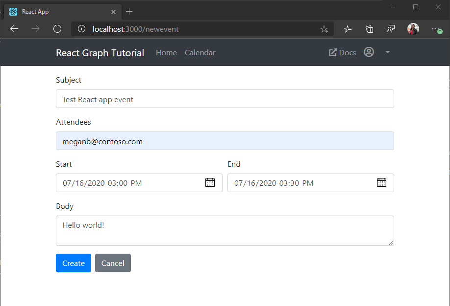

<!-- markdownlint-disable MD002 MD041 -->

<span data-ttu-id="aeee0-101">Dans cette section, vous allez ajouter la possibilité de créer des événements dans le calendrier de l’utilisateur.</span><span class="sxs-lookup"><span data-stu-id="aeee0-101">In this section you will add the ability to create events on the user's calendar.</span></span>

## <a name="add-method-to-graphservice"></a><span data-ttu-id="aeee0-102">Ajouter une méthode à GraphService</span><span class="sxs-lookup"><span data-stu-id="aeee0-102">Add method to GraphService</span></span>

1. <span data-ttu-id="aeee0-103">Ouvrez **./SRC/GraphService.TS** et ajoutez la fonction suivante pour créer un événement.</span><span class="sxs-lookup"><span data-stu-id="aeee0-103">Open **./src/GraphService.ts** and add the following function to create a new event.</span></span>

    :::code language="typescript" source="../demo/graph-tutorial/src/GraphService.ts" id="createEventSnippet":::

## <a name="create-new-event-form"></a><span data-ttu-id="aeee0-104">Créer un formulaire d’événement</span><span class="sxs-lookup"><span data-stu-id="aeee0-104">Create new event form</span></span>

1. <span data-ttu-id="aeee0-105">Créez un fichier dans le répertoire **./SRC** nommé **NewEvent. TSX** et ajoutez le code suivant.</span><span class="sxs-lookup"><span data-stu-id="aeee0-105">Create a new file in the **./src** directory named **NewEvent.tsx** and add the following code.</span></span>

    :::code language="typescript" source="../demo/graph-tutorial/src/NewEvent.tsx" id="NewEventSnippet":::

1. <span data-ttu-id="aeee0-106">Ouvrez **./SRC/App.TSX** et ajoutez l' `import` instruction suivante en haut du fichier.</span><span class="sxs-lookup"><span data-stu-id="aeee0-106">Open **./src/App.tsx** and add the following `import` statement to the top of the file.</span></span>

    ```typescript
    import NewEvent from './NewEvent';
    ```

1. <span data-ttu-id="aeee0-107">Ajoutez un nouvel itinéraire dans le nouveau formulaire d’événement.</span><span class="sxs-lookup"><span data-stu-id="aeee0-107">Add a new route to the new event form.</span></span> <span data-ttu-id="aeee0-108">Ajoutez le code suivant juste après les autres `Route` éléments.</span><span class="sxs-lookup"><span data-stu-id="aeee0-108">Add the following code just after the other `Route` elements.</span></span>

    ```typescript
    <Route exact path="/newevent"
      render={(props) =>
        this.props.isAuthenticated ?
          <NewEvent {...props} /> :
          <Redirect to="/" />
      } />
    ```

    <span data-ttu-id="aeee0-109">L' `return` instruction complète doit maintenant ressembler à ce qui suit.</span><span class="sxs-lookup"><span data-stu-id="aeee0-109">The full `return` statement should now look like this.</span></span>

    :::code language="typescript" source="../demo/graph-tutorial/src/App.tsx" id="renderSnippet" highlight="23-28":::

1. <span data-ttu-id="aeee0-110">Actualisez l’application et naviguez jusqu’à l’affichage Calendrier.</span><span class="sxs-lookup"><span data-stu-id="aeee0-110">Refresh the app and browse to the calendar view.</span></span> <span data-ttu-id="aeee0-111">Cliquez sur le bouton **nouvel événement** .</span><span class="sxs-lookup"><span data-stu-id="aeee0-111">Click the **New event** button.</span></span> <span data-ttu-id="aeee0-112">Renseignez les champs, puis cliquez sur **créer**.</span><span class="sxs-lookup"><span data-stu-id="aeee0-112">Fill in the fields and click **Create**.</span></span>

    
