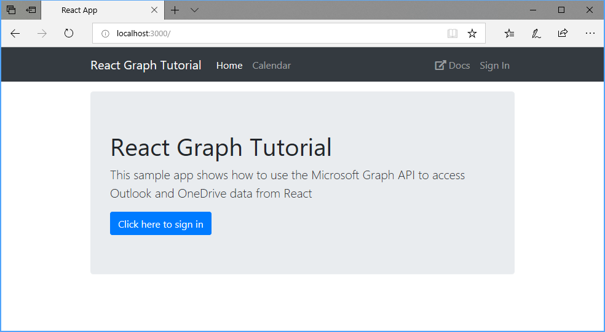

<!-- markdownlint-disable MD002 MD041 -->

Ouvrez votre interface de ligne de commande (CLI), accédez à un répertoire dans lequel vous disposez de droits de création de fichiers et exécutez les commandes suivantes pour installer l'outil de création d'application de [réaction](https://www.npmjs.com/package/create-react-app) et créer une nouvelle application REACT.

```Shell
npm install create-react-app@2.1.0 -g
create-react-app graph-tutorial
```

Une fois la commande terminée, accédez au `graph-tutorial` répertoire dans votre interface CLI et exécutez la commande suivante pour démarrer un serveur Web local.

```Shell
npm start
```

Votre navigateur par défaut s' [https://localhost:3000/](https://localhost:3000) ouvre sur avec une page REACT par défaut. Si votre navigateur ne s'ouvre pas, ouvrez-le [https://localhost:3000/](https://localhost:3000) et accédez à pour vérifier que la nouvelle application fonctionne.

Avant de poursuivre, installez des packages supplémentaires que vous utiliserez plus tard:

- [REACT-Router-DOM](https://github.com/ReactTraining/react-router) pour le routage déclaratif au sein de l'application REACT.
- [bootstrap](https://github.com/twbs/bootstrap) pour le style et les composants communs.
- [reactstrap](https://github.com/reactstrap/reactstrap) pour les composants REACT basés sur bootstrap.
- [fontawesome](https://github.com/FortAwesome/Font-Awesome) n'est pas disponible pour les icônes.
- [moment](https://github.com/moment/moment) de mise en forme des dates et des heures.
- [MSAL](https://github.com/AzureAD/microsoft-authentication-library-for-js) pour l'authentification auprès d'Azure Active Directory et pour la récupération des jetons d'accès.
- [Microsoft-Graph-client](https://github.com/microsoftgraph/msgraph-sdk-javascript) pour effectuer des appels à Microsoft Graph.

Exécutez la commande suivante dans votre interface CLI.

```Shell
npm install react-router-dom@4.3.1 bootstrap@4.1.3 reactstrap@6.5.0 @fortawesome/fontawesome-free@5.4.2
npm install moment@2.22.2 msal@0.2.3 @microsoft/microsoft-graph-client@1.3.0
```

## <a name="design-the-app"></a>Concevoir l'application

Commencez par créer une barre de navigation pour l'application. Créez un fichier dans le `./src` répertoire nommé `Navbar.js` et ajoutez le code suivant.

```JSX
import React from 'react';
import { NavLink as RouterNavLink } from 'react-router-dom';
import {
  Collapse,
  Container,
  Navbar,
  NavbarToggler,
  NavbarBrand,
  Nav,
  NavItem,
  NavLink,
  UncontrolledDropdown,
  DropdownToggle,
  DropdownMenu,
  DropdownItem } from 'reactstrap';
import '@fortawesome/fontawesome-free/css/all.css';

function UserAvatar(props) {
  // If a user avatar is available, return an img tag with the pic
  if (props.user.avatar) {
    return </img>;
  }

  // No avatar available, return a default icon
  return <i
          className="far fa-user-circle fa-lg rounded-circle align-self-center mr-2"
          style={{width: '32px'}}></i>;
}

function AuthNavItem(props) {
  // If authenticated, return a dropdown with the user's info and a
  // sign out button
  if (props.isAuthenticated) {
    return (
      <UncontrolledDropdown>
        <DropdownToggle nav caret>
          <UserAvatar user={props.user}/>
        </DropdownToggle>
        <DropdownMenu right>
          <h5 className="dropdown-item-text mb-0">{props.user.displayName}</h5>
          <p className="dropdown-item-text text-muted mb-0">{props.user.email}</p>
          <DropdownItem divider />
          <DropdownItem onClick={props.authButtonMethod}>Sign Out</DropdownItem>
        </DropdownMenu>
      </UncontrolledDropdown>
    );
  }

  // Not authenticated, return a sign in link
  return (
    <NavItem>
      <NavLink onClick={props.authButtonMethod}>Sign In</NavLink>
    </NavItem>
  );
}

export default class NavBar extends React.Component {
  constructor(props) {
    super(props);

    this.toggle = this.toggle.bind(this);
    this.state = {
      isOpen: false
    };
  }

  toggle() {
    this.setState({
      isOpen: !this.state.isOpen
    });
  }

  render() {
    // Only show calendar nav item if logged in
    let calendarLink = null;
    if (this.props.isAuthenticated) {
      calendarLink = (
        <NavItem>
          <RouterNavLink to="/calendar" className="nav-link" exact>Calendar</RouterNavLink>
        </NavItem>
      );
    }

    return (
      <div>
        <Navbar color="dark" dark expand="md" fixed="top">
          <Container>
            <NavbarBrand href="/">React Graph Tutorial</NavbarBrand>
            <NavbarToggler onClick={this.toggle} />
            <Collapse isOpen={this.state.isOpen} navbar>
              <Nav className="mr-auto" navbar>
                <NavItem>
                  <RouterNavLink to="/" className="nav-link" exact>Home</RouterNavLink>
                </NavItem>
                {calendarLink}
              </Nav>
              <Nav className="justify-content-end" navbar>
                <NavItem>
                  <NavLink href="https://developer.microsoft.com/graph/docs/concepts/overview" target="_blank">
                    <i className="fas fa-external-link-alt mr-1"></i>
                    Docs
                  </NavLink>
                </NavItem>
                <AuthNavItem
                  isAuthenticated={this.props.isAuthenticated}
                  authButtonMethod={this.props.authButtonMethod}
                  user={this.props.user} />
              </Nav>
            </Collapse>
          </Container>
        </Navbar>
      </div>
    );
  }
}
```

Ensuite, créez une page d'accueil pour l'application. Créez un fichier dans le `./src` répertoire nommé `Welcome.js` et ajoutez le code suivant.

```JSX
import React from 'react';
import {
  Button,
  Jumbotron } from 'reactstrap';

function WelcomeContent(props) {
  // If authenticated, greet the user
  if (props.isAuthenticated) {
    return (
      <div>
        <h4>Welcome {props.user.displayName}!</h4>
        <p>Use the navigation bar at the top of the page to get started.</p>
      </div>
    );
  }

  // Not authenticated, present a sign in button
  return <Button color="primary" onClick={props.authButtonMethod}>Click here to sign in</Button>;
}

export default class Welcome extends React.Component {
  render() {
    return (
      <Jumbotron>
        <h1>React Graph Tutorial</h1>
        <p className="lead">
            This sample app shows how to use the Microsoft Graph API to access Outlook and OneDrive data from React
        </p>
        <WelcomeContent
          isAuthenticated={this.props.isAuthenticated}
          user={this.props.user}
          authButtonMethod={this.props.authButtonMethod} />
      </Jumbotron>
    );
  }
}
```

À présent, créez un message d'erreur pour afficher les messages destinés à l'utilisateur. Créez un fichier dans le `./src` répertoire nommé `ErrorMessage.js` et ajoutez le code suivant.

```JSX
import React from 'react';
import { Alert } from 'reactstrap';

export default class ErrorMessage extends React.Component {
  render() {
    let debug = null;
    if (this.props.debug) {
      debug = <pre className="alert-pre border bg-light p-2"><code>{this.props.debug}</code></pre>;
    }
    return (
      <Alert color="danger">
        <p className="mb-3">{this.props.message}</p>
        {debug}
      </Alert>
    );
  }
}
```

Maintenant que les composants de base sont définis, mettez à jour l'application pour les utiliser. Tout d'abord, `./src/index.css` Ouvrez le fichier et remplacez l'intégralité de son contenu par ce qui suit.

```css
body {
  padding-top: 4.5rem;
}

.alert-pre {
  word-wrap: break-word;
  word-break: break-all;
  white-space: pre-wrap;
}
```

Ensuite, ouvrez `./src/App.js` et remplacez l'intégralité de son contenu par ce qui suit.

```JSX
import React, { Component } from 'react';
import { BrowserRouter as Router, Route } from 'react-router-dom';
import { Container } from 'reactstrap';
import NavBar from './NavBar';
import ErrorMessage from './ErrorMessage';
import Welcome from './Welcome';
import 'bootstrap/dist/css/bootstrap.css';

class App extends Component {
  constructor(props) {
    super(props);

    this.state = {
      isAuthenticated: false,
      user: {},
      error: null
    };
  }

  render() {
    let error = null;
    if (this.state.error) {
      error = <ErrorMessage message={this.state.error.message} debug={this.state.error.debug} />;
    }

    return (
      <Router>
        <div>
          <NavBar
            isAuthenticated={this.state.isAuthenticated}
            authButtonMethod={null}
            user={this.state.user}/>
          <Container>
            {error}
            <Route exact path="/"
              render={(props) =>
                <Welcome {...props}
                  isAuthenticated={this.state.isAuthenticated}
                  user={this.state.user}
                  authButtonMethod={null} />
              } />
          </Container>
        </div>
      </Router>
    );
  }

  setErrorMessage(message, debug) {
    this.setState({
      error: {message: message, debug: debug}
    });
  }
}

export default App;
```

Enregistrez toutes vos modifications et actualisez la page. À présent, l'application doit être très différente.

